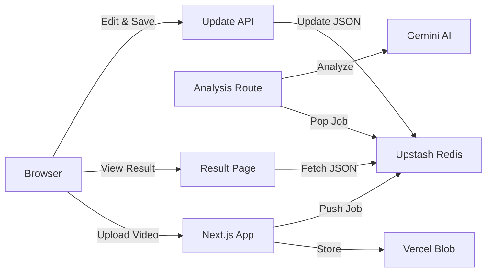

# SpaceScanX 프로젝트 현황 리포트

**작성일시**: 2026-01-17
**작성자**: Antigravity Assistant

## 1. 프로젝트 개요 (Overview)
SpaceScanX는 방 안을 촬영한 비디오를 **Gemini 3 Pro** AI를 활용해 분석하고, 이를 **인터랙티브한 2D 평면도(Floorplan)**로 변환해주는 웹 애플리케이션입니다.

- **Stack**: Next.js 16 (App Router), Prisma, Updated `params` logic
- **Infrastructure**: Vercel Blob (Storage), Upstash Redis (Queue), Dockerized PostgreSQL
- **AI Model**: Google Gemini 1.5/3.0 Pro

## 2. 미션별 진행 상황 (Mission Status)

### [MISSION 1] 인프라 및 인증 (완료 ✅)
- **개발 환경**: Next.js 14+ 기반 설정, Tailwind CSS/Lucide UI 적용 완료.
- **데이터베이스**: 로컬 Docker PostgreSQL + Prisma ORM 연동 완료.
- **인증**: Clerk Auth 연동 완료. (개발 편의를 위해 로그인 강제 로직 일부 우회 중)

### [MISSION 2] 분석 파이프라인 (완료 ✅)
- **업로드**: Vercel Blob을 이용한 대용량 비디오 업로드 구현 완료.
- **큐 처리**: Upstash Redis를 활용한 비동기 작업 큐(`analysis-queue`) 구현 완료.
- **AI 워커**: Mockup/Gemini SDK를 활용한 분석 로직(`app/api/worker`) 구현 완료. (현재는 Mock Data/Prompt 기반)

### [MISSION 3] 인터랙티브 렌더러 (진행 중 🚧)
현재 가장 활발하게 개발 중인 영역입니다.

- **SVG 렌더러 (완료)**: `types/floorplan.ts`에 정의된 데이터 구조를 기반으로 벽(Wall), 문(Door), 창문(Window), 가구(Item)를 시각화.
- **줌/팬/드래그 (완료)**: `react-zoom-pan-pinch` 라이브러리를 도입하여 부드러운 확대/축소 및 이동 구현.
    - *이슈 해결*: 초기 렌더링 시 좌상단 처박힘 문제 -> `w-full h-full` 강제 스타일 주입으로 중앙 정렬 해결.
- **편집 모드 (완료)**: 가구 아이템을 드래그하여 위치를 조정하는 기능(`FloorplanEditor`) 구현.
- **데이터 저장 (완료)**: 수정된 좌표를 Redis에 반영하는 `PATCH /api/floorplan/[jobId]` API 구현.
    - *이슈 해결*: 저장 시 Job Status가 갱신되지 않아 UI에 반영되지 않던 문제 -> 상태를 `completed`로 강제 업데이트하도록 수정하여 해결.

## 3. 현재 시스템 아키텍처

## 4. 알려진 이슈 및 해결 방법 (Known Issues)

1.  **Clerk CAPTCHA**: 로컬 개발 시 Clerk의 Google 로그인 캡차 문제가 발생하여, 업로드 페이지에서 임시로 로그인을 우회하도록 설정함(`actions/upload.ts`).
2.  **Next.js 15+ Params**: 동적 라우트(`[jobId]`)에서 `params`가 Promise로 변경됨에 따라 빌드 에러 발생 -> `await params`로 코드 수정 완료.

## 6. 최근 해결된 주요 이슈 (Resolved Issues)
1.  **Gemini Model 404 Error**: `gemini-1.5-flash` 등 일부 모델 별칭이 API에서 인식되지 않는 문제 발생.
    - *해결*: 최신 프리뷰 모델 **`gemini-2.5-flash-preview-09-2025`**로 변경하여 해결 및 분석 성능 향상.
2.  **Worker Retry Logic**: 일시적 실패 시 큐에서 사라진 작업을 재시도하기 위해 `debugJobId`를 통한 수동 트리거 로직 추가.
3.  **Upload Redirect & Processing**: 업로드 후 결과 페이지로 리다이렉트되지 않던 문제 해결.
    - *해결*: `router.push('/results/[jobId]')` 추가.
    - *개선*: 개발 환경에서 업로드 직후 Worker를 자동 트리거하도록 `actions/upload.ts` 수정.
4.  **Pending Status Stuck**: 큐에 쌓인 이전 작업으로 인해 최신 작업이 처리되지 않던 문제.
    - *해결*: Worker가 큐를 정상적으로 소모하도록 조치 및 Status Polling용 API (`/api/jobs/[jobId]`) 신설.
5.  **Analysis UX Improvement**: 분석 대기 시간 동안 사용자 피드백 부재.
    - *해결*: `JobPoller` 컴포넌트 구현. "Analyzing Space..." 로딩 화면 및 자동 새로고침(Polling) 적용.

## 7. 다음 단계 (Next Steps)
- **Mission 3 (Interactive Renderer) 검증**: 드래그 앤 드롭, 수정사항 저장(Persistence) 기능 수동 테스트.

1.  **최종 검증 및 배포**: Vercel 등 실제 환경 배포 테스트.

---
현재 핵심 기능(업로드 -> 분석(Mock) -> 렌더링 -> 편집 -> 저장)의 **End-to-End 흐름**이 모두 연결된 상태입니다.
